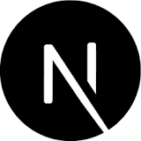
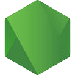
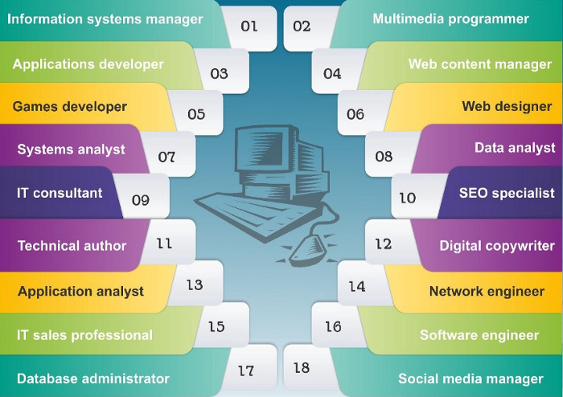

  

Hello, I'm a passionate self-taught Blockchain developer and software engineer from worldwide.
I take great care in the experience, architecture, and code quality of the things I build.

## Experienced Front-End & APP

<table>
  <tr>
    <td align="center" width="70">
      
       React
    </td>
    <td align="center" width="70">
      
       Next.js
    </td>
    <td align="center" width="70">
      
       Vite
    </td>
    <td align="center" width="70">
      
       Vue
    </td>
    <td align="center" width="70">
      
       Nuxt
    </td>
    <td align="center" width="70">
      
       Angular
    </td>
    <td align="center" width="70">
      
       Flutter
    </td>
    <td align="center" width="70">
      
       Swift
    </td>
    
</table>

## Experienced Back-End FrameWorks

<table>
  <tr>
    <td align="center" width="70">
      
       Spring
    </td>
    <td align="center" width="70">
      
       ASP.NET
    </td>
    <td align="center" width="70">
      
       Rocket
    </td>
    <td align="center" width="70">
      
       Node.js
    </td>
    <td align="center" width="70">
      
       Express
    </td>
    <td align="center" width="70">
      
       Nest.js
    </td>
    <td align="center" width="70">
      
       Django
    </td>
    <td align="center" width="70">
      
       FastApi
    </td>
    <td align="center" width="70">
      
       Flask
    </td>
    <td align="center" width="70">
      
       Gin
    </td>
</table>

## Experienced CMS

<table>
  <tr>
    <td align="center" width="70">
      
       Wordpress
    </td>
     <td align="center" width="70">
      
       Shopify
    </td>
    <td align="center" width="70">
      
       Magnolia
    </td>
    <td align="center" width="70">
      
       Payload
    </td>
    <td align="center" width="70">
      
       Strapi
    </td>
    <td align="center" width="70">
      
       Sanity
    </td>
    <td align="center" width="70">
      
       Joomla
    </td>
    <td align="center" width="70">
      
       Drapal
    </td>
    
</table>

## Experienced Blockchain Networks

<table>
  <tr>
    <td align="center" width="70">
      
       Solana
    </td>
    <td align="center" width="70">
      
       Ethereum
    </td>
    <td align="center" width="70">
      
       Polygon
    </td>
    <td align="center" width="70">
      
       Binance
    </td>
    <td align="center" width="70">
      
       Avalanche
    </td>
    <td align="center" width="70">
      
       Bitcoin
    </td>
    <td align="center" width="70">
      
       Cardano
    </td>
    <td align="center" width="70">
      
       Cronos
    </td>
    <td align="center" width="70">
      
       Near
    </td>
    <td align="center" width="70">
      
       cosmos
    </td>
  </tr>
</table>

<h2 align="left" id="macropower-tech">Favorite Tech</h2>

**- Programming languages**

    
    
    
    
    
    
    

**- Framework and Library**

    
    
     
      
      
    
    
    
    
    
     

**- Databases and cloud hosting**

    
    
    
    
     
    
    
    
    
    
    
    

**- Software and tools**

    
    
    
    
    
    
    
    
    
    

